# 版本说明

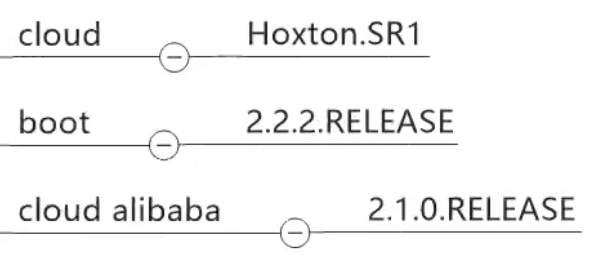

# SpringCloud服务架构

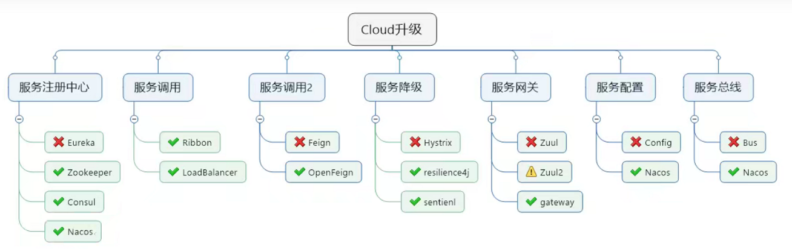

# cloud-provider-payment8001 (服务端 提供者)

微服务模块module创建过程

~~~java
1.创建module
2.写pom文件
3.写yml文件
4.写主启动类
5.写业务类
~~~

## 热部署 devtools

1. 父POM中 插入devtools jar包，maven插件
~~~xml
<!--    热部署    -->
<dependency>
    <groupId>org.springframework.boot</groupId>
    <artifactId>spring-boot-devtools</artifactId>
    <scope>runtime</scope>
    <optional>true</optional>
</dependency>
        
<!--   maven插件   -->
<plugin>
    <groupId>org.springframework.boot</groupId>
    <artifactId>spring-boot-maven-plugin</artifactId>
    <configuration>
        <fork>true</fork>
        <addResources>true</addResources>
    </configuration>
</plugin>

~~~

2.yml配置文件注明
~~~yaml
spring:
  devtools:
    remote:
      restart:
        enabled: true #开启热部署
  freemarker:
    cache: true #页面不加载缓存，修改即时生效
~~~

2. 开启自动构建项目

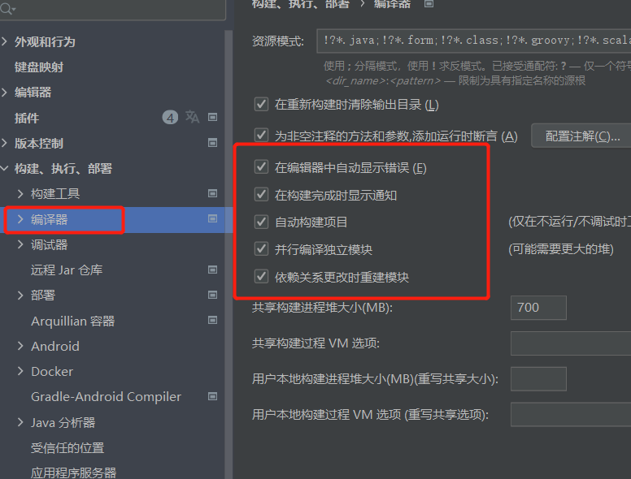

3. ctrl+shift+alt+/ 快捷键 打开注册表，勾选两个配置

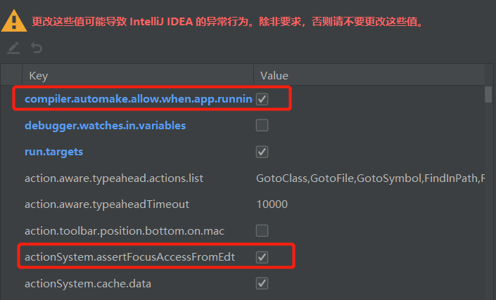

# cloud-consumer-order80 (客户端 消费者)

## RestTemplate

提供了多种便捷访问远程Http服务的方法，是一种简单便捷访问restful服务模板类，是Spring提供的用于访问Rest服务的 客户端 模板工具集

使用restTemplate访问restful接口
~~~text
（url，requestMap，ResponseBean.class）
REST请求地址，请求参数，HTTP响应转换被转换成的对象类型
~~~

@Bean 将组件注册到spring的IOC容器中
~~~java

@Bean
public RestTemplate getRestTemplate(){

    return new RestTemplate();
}
~~~

* 常用四个方法 get/postForObject、get/postForEntity

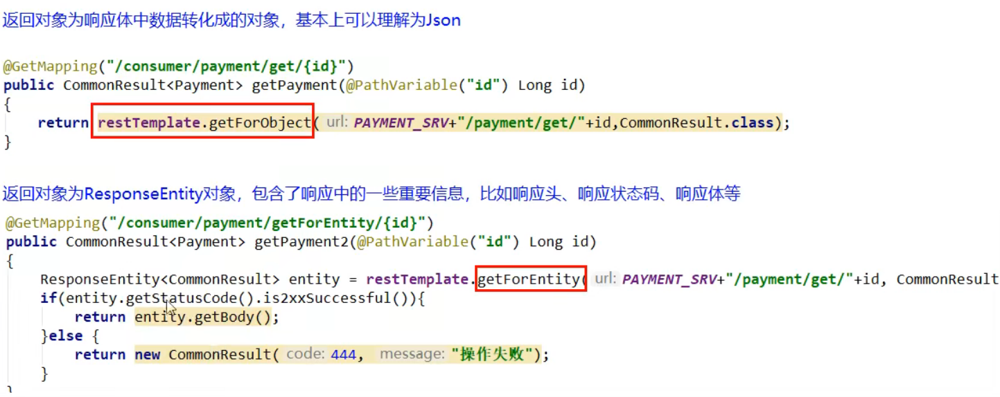

# Eureka 注册中心

1. 服务治理

    SpringCloud封装了Netflix(奈飞)公司开发的Eureka模块来实现服务治理

    在传统的rpc远程调用框架中，管理每个服务与服务之间依赖关系比较复杂，管理比较复杂，所以需要使用服务治理，管理服务于服务之间的依赖关系，可以实现服务调用、负载均衡、容错等，实现服务发现与注册

2. 服务注册
    
    Eureka采用了CS的设计架构，Eureka Server 作为服务注册功能的服务器，他是服务注册中心。而系统中的其他服务，使用Eureka的客户端连接到 EurekaServer并维持心跳连接，这样系统的维护人员就可以通过EurekaServer来监控系统中各个微服务是否正常运行

    在服务注册与发现中，有一个注册中心。当服务器启动时，会把当前自己服务器的信息比如服务地址通讯地址等以别名方式注册到注册中心。另一方（消费者|提供者），以该别名的方式去注册中心上获取到实际的服务通讯地址，然后再实现本地RPC调用RPC远程调用框架核心设计思想：在于注册中心，因为使用注册中心管理每个服务与服务间的依赖关系（服务治理概念）。在任何RPC远程框架下，都会有一个注册中心（存放服务地址、接口地址）

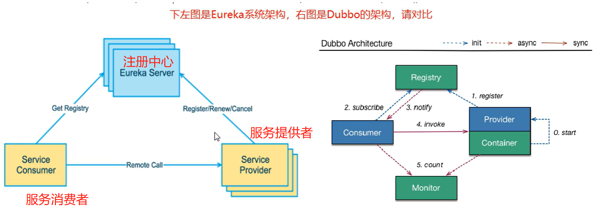

3. Eureka 包含的两个组件 Eureka Server 和 Eureka Client

* Eureka Server 注册中心
   各个微服务节点通过配置启动后，会在EurekaServer中进行注册，这样EurekaServer中的服务注册表中将会存储所有可用服务节点的信息，服务节点的信息可以在界面中直观看到
  
* Eureka Client 注册服务
   是一个java客户端，用于简化Eureka Server的交互，客户端同时也具备一个内置的、使用轮询（round-robin）负载算法的负载均衡器。在应用启动后，将会向Eureka Server发送心跳（默认周期为30秒）。如果Eureka Server在多个心跳周期内没有接收到某个节点的心跳，EurekaServer将会从服务注册表中把这个服务节点移除（默认90秒）

# cloud-eureka-server7001 (注册中心)

配置流程

1. 引入eureka server jar包
~~~xml
<dependency>
   <groupId>org.springframework.cloud</groupId>
   <artifactId>spring-cloud-starter-netflix-eureka-server</artifactId>
</dependency>
~~~

2. 配置yml文件
~~~yaml
server:
  port: 7001

eureka:
  instance:
    hostname: localhost #eureka服务端的实例名称
  client:
    register-with-eureka: false #false表示自己不向注册中心注册自己
    fetch-registry: false #false表示自己就是注册中心，职责是维护服务实例，不需要检索服务
    service-url:
      defaultZone: http://${eureka.instance.hostname}:${server.port}/eureka/ #设置与Eureka Server交互的地址查询服务和注册服务
~~~

3. 启动类上添加 @EnableEurekaServer 注解
~~~java
@SpringBootApplication
@EnableEurekaServer
public class EurekaMain7001 {
    public static void main(String[] args) {
        SpringApplication.run(EurekaMain7001.class,args);
    }
}
~~~

其他服务在 注册中心 注册服务

1. 引入eureka client jar包
~~~xml
<!-- eureka-client 向服务注册中心发送消息 -->
<dependency>
   <groupId>org.springframework.cloud</groupId>
   <artifactId>spring-cloud-starter-netflix-eureka-client</artifactId>
</dependency>
~~~

2. 配置yml文件
~~~yaml
eureka:
  client:
    register-with-eureka: true #默认为true，表示把自己注册进Eureka Server
    fetchRegistry: true # 是否抓取已有的注册信息，默认为true。单节点无所谓，集群必须位置为true才能配合ribbon使用负载均衡
    service-url:
      defaultZone: http://localhost:7001/eureka
~~~

3. 主启动类加 @EnableEurekaClient 注解
~~~java
@SpringBootApplication
@EnableEurekaClient
public class PaymentMain8001 {

    public static void main(String[] args) {
        SpringApplication.run(PaymentMain8001.class,args);
    }
}
~~~

# Eureka集群原理

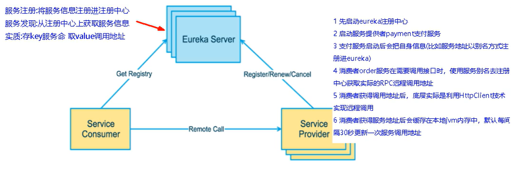

## 注册中心 集群 

Eureka集群步骤：修改yml配置，让注册中心 相互注册，相互守望
~~~yaml
server:
  port: 7001

eureka:
  instance:
    hostname: eureka7001.com #eureka服务端的实例名称
  client:
    register-with-eureka: false #false表示自己不向注册中心注册自己
    fetch-registry: false #false表示自己就是注册中心，职责是维护服务实例，不需要检索服务
    service-url:
      defaultZone: http://eureka7002.com:7002/eureka/ #设置与Eureka Server交互的地址查询服务和注册服务

~~~

## 服务端（提供者） 集群

cloud-provider-payment8001，cloud-provider-payment8002作为服务提供者，对外有相同的服务名称：cloud-payment-service；所以消费者调用时，需要用到负载均衡

1. 在Controller层定义的 提供者URL 统一改成 服务提供者名称
~~~java
public static final String PAYMENT_URL = "http://CLOUD-PAYMENT-SERVICE";
~~~

2. 在 RestTemplate 工具类中添加负载均衡注解 @LoadBalanced
~~~java  
@Configuration
public class ApplicationContextConfig {

    @Bean
    @LoadBalanced //让RestTemplate具有负载均衡的能力
    public RestTemplate getRestTemplate(){

        return new RestTemplate();
    }
}
~~~

Eureka集群简略图示

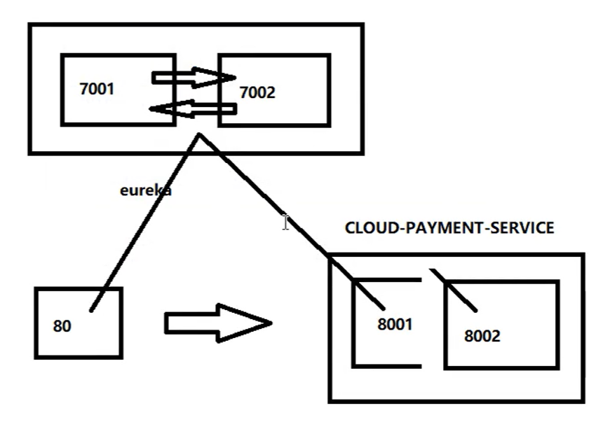

## Discovery 服务发现 

功能：对于注册进Eureka的微服务，可以通过服务发现来获得该服务的信息

1. 启动类添加注解 @EnableDiscoveryClient 开启发现客户端
~~~java
@SpringBootApplication
@EnableEurekaClient //启动Eureka客户端
@EnableDiscoveryClient //启动服务发现
public class PaymentMain8001 {

   public static void main(String[] args) {
      SpringApplication.run(PaymentMain8001.class,args);
   }
}
~~~

2. 控制层 注入 EurekaDiscoveryClient 对象，服务发现 获取实例
~~~java
@RestController
@Slf4j //日志
public class PaymentController {
   @Resource
   private EurekaDiscoveryClient eurekaDiscoveryClient;

   @GetMapping(value = "/payment/discovery")
   public Object discovery(){

      List<String> services = eurekaDiscoveryClient.getServices();
      for (String service : services) {
         log.info("**** service:"+service);//service:cloud-consumer-order; service:cloud-consumer-order
      }
      //服务发现 获取实例方法 getInstances("注册中心服务别名")
      List<ServiceInstance> instances = eurekaDiscoveryClient.getInstances("CLOUD-PAYMENT-SERVICE");

      for (ServiceInstance instance : instances) {
         log.info(instance.getInstanceId()+"\t"+instance.getHost()+"\t"+instance.getUri()+"\t"+instance.getPort());
         //payment8002	172.16.66.166	http://172.16.66.166:8002	8002
         //payment8001	172.16.66.166	http://172.16.66.166:8001	8001
      }
      return  this.eurekaDiscoveryClient;
   }

}
~~~

## Eureka 自我保护机制

概述：某时刻某一个微服务不可用了，Eureka不会立刻清理，依旧会对该服务信息进行保存

* 为什么会产生Eureka自我保护机制？
~~~text
为了防止EurekaClient可以正常运行，但是与EurekaServer网络不通情况下，EurekaServer不会立刻将EurekaClient服务剔除
~~~

* 什么是自我保护机制？
~~~text
默认情况下，如果EurekaServer在一定时间内（默认90秒）没有接收到某个微服务实例的心跳，EurekaServer将会注册该实例。

但网络故障发生（延时、卡顿、拥挤），微服务与EurekaServer无法正常通讯，以上行为就会很危险——因为服务本身是健康的，此时不应该注册这个微服务。
Eureka通过“自我保护模式”解决这个问题，当EurekaServer节点在 短时间内丢失过多客户端时，这个节点就会进入自我保护模式。

在自我保护模式中，EurekaServer会保护服务注册表中的信息，不会注销任何服务实例
他的设计哲学就是：宁可保留错误的服务注册信息，也不盲目注销任何可能健康的服务实例

综上，自我保护模式是一种应对网络异常的安全保护措施。他的架构哲学是：宁可同时保护所有微服务也不盲目注销任何可能健康的微服务
~~~

* 禁止自我保护模式
~~~yml
# EurekaServer yml配置文件
eureka:
   server:
      enable-self-preservation: false #关闭自我保护机制，保证服务不可用时被及时剔除
      eviction-interval-timer-in-ms: 2000 #服务2秒没有反应就直接剔除
~~~

~~~yaml
# EurekaClient yml配置文件
eureka:
   instance:
      lease-expiration-duration-in-seconds: 2 #Eureka服务端在收到最后一次心跳后等待时间上限，默认90秒，超时剔除服务
      lease-renewal-interval-in-seconds: 1 #Eureka客户端向服务端发送心跳时间间隔，默认30秒
~~~

# Consul 注册中心

~~~text

下载地址 https://www.consul.io/downloads

启动命令 consul agent -dev

服务网址 http://localhost:8500
~~~

# CAP
~~~text
C 强一致性 Consistency

A 可用性 Availability 

P 分区容错性 Partition tolerance 

AP(Eureka)、CP(ZK、Consul)
~~~

CAP的核心理论：一个分布式不可能同时很好的满足一致性、可用性、分区容错性；因此，根据CAP原理将NoSQL数据库分为满足CA原则，满足CP原则，满足AP原则三类
~~~text
CA 单点集群，满足一致性，可用性的系统，通常在可扩展性不强

CP 满足一致性，分区容错性的系统，通常性能不是太高

AP 满足可用，分区容错性的系统，通常对一致性要求低
~~~

## AP架构

当网络分区出现后，为了保证可用性，系统B可以返回旧值，保证系统的可用性。结论：违背了C（一致性）的要求，只满足可用性和分区容错性，即AP

.png)

## CP架构

当网络分区出现后，为了保证一致性，就必须拒绝访问，否则无法保证一致性；结论：违背了A(可用性)的要求，只满足一致性和分区容错性，即CP

.png)

# Ribbon 

概述：Spring Cloud Ribbon 是基于Netflix Ribbon实现的一套客户端 负载均衡的工具
~~~text
简单的说，Ribbon是Netflix发布的开源项目，主要功能是提供客户端软件负载均衡算法和服务调用。Ribbon客户端组件提供一系列完善的配置选项如连接超时，重试等。
简单的说就是配置文件中列出Load Balancer(LB)后面所有的机器，Ribbon会自动帮你基于某种规则（如轮询，随机连接等）去连接机器，我们很容易使用Ribbon实现自定义的负载均衡算法。
~~~

## Load Balance 负载均衡

* Ribbon本地负载均衡客户端 Nginx服务端负载均衡 区别

~~~text
Nginx是对服务器负载均衡，客户端把所有请求都交给nginx，然后由nginx实现转发请求。即负载均衡是由服务端实现的。
Ribbon本地负载均衡，在调用微服务接口时，会在注册中心上获取注册信息服务列表之后缓存到JVM本地，从而在本地实现PRC远程服务调用。
~~~

* Ribbon在工作时分为两步

~~~text
第一步：先选择EurekaServer，它优先选择在同一个区域内负载均衡较少的server

第二步：根据用户制定的策略，在server取到的服务注册列表中选择一个地址

其中Ribbon提供了多种策略：轮询、随机、根据响应时间加权
~~~

## 核心组件 IRule

* 根据特定算法中从服务列表中选取一个要访问的服务

~~~text
com.netflix.loadbalancer.RoundRobinRule：轮询(默认)

com.netflix.loadbalancer.RandomRule：随机

com.netflix.loadbalancer.RetryRule：先按照RoundRobinRule的策略获取服务,如果获取服务失败则在指定时间内进行重试,获取可用的服务

WeightedResponseTimeRule：对RoundRobinRule的扩展,响应速度越快的实例选择权重越多大,越容易被选择

BestAvailableRule：会先过滤掉由于多次访问故障而处于断路器跳闸状态的服务,然后选择一个并发量最小的服务

AvailabilityFilteringRule：先过滤掉故障实例,再选择并发较小的实例

ZoneAvoidanceRule：默认规则,复合判断server所在区域的性能和server的可用性选择服务器
~~~

* 替换规则

1. 配置自定义规则工具类

注意：自定义配置类不能放在@ComponentScan所扫描到的当前包及以下，所以配置包要和主启动类包同级

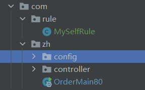

~~~java
@Configuration
public class MySelfRule {
    @Bean
    public IRule myRule() {
       return new RandomRule(); // 负载均衡规则为 随机
    }
}
~~~

2. 主启动类添加 @RibbonClient 注解
~~~java
@RibbonClient(name = "CLOUD-PAYMENT-SERVICE",configuration = MySelfRule.class) //表示该服务使用自定义负载均衡规则
public class OrderMain80 {
    public static void main(String[] args) {
        SpringApplication.run(OrderMain80.class,args);
    }
}
~~~

* 轮询算法解析

负载均衡算法：rest接口第几次请求数 % 服务器集群总数 = 实际调用服务器位置下标

~~~text
每次服务器重启后rest接口计数从1开始

List<ServiceInstance> instances = discoveryClient.getInstances("CLOUD-PAYMENT-SERVICE")

比如： List[0] instances = 127.0.0.1:8001
      List[1] instances = 127.0.0.1:8002

8001和8002组成集群，共计2台机器，集群数为2，按照轮询算法原理：

当总数请求为1时， 1 % 2 = 1，对应下标位置为1，则获得服务地址为127.0.0.1:8002
当总数请求为2时， 2 % 2 = 0，对应下标位置为0，则获得服务地址为127.0.0.1:8001
当总数请求为3时， 3 % 2 = 1，对应下标位置为1，则获得服务地址为127.0.0.1:8002
当总数请求为4时， 4 % 2 = 1，对应下标位置为0，则获得服务地址为127.0.0.1:8001
以此类推....
~~~

# OpenFeign

* Feign能干什么？ 服务接口绑定器

前面在使用 Ribbon+RestTemplate，利用RestTemplate对http请求的封装处理，形成了一套模板化的调用方法。但实际开发中，由于对服务依赖的调用可能不止一处，**往往一个接口会被多处调用，所以通常都会针对每个微服务自行封装一些客户端类来包装这些依赖服务的调用。**
所以，Feign在此基础上做了进一步封装，由他来帮助我们定义和实现依赖服务接口的定义。在Feign的实现下，**我们只需创建一个接口并使用注解的方式来配置他（以前Dao接口上面标注Mapper注解，现在是一个微服务接口上面标注一个Feign注解即可）**，即可完成对服务提供方的接口绑定，
简化了使用Spring Cloud Ribbon时，自动封装服务调用客户端的开发量

* Feign集成Ribbon

利用Ribbon维护了Payment的服务列表信息，并且通过轮询实现了客户端的负载均衡。而与Ribbon不同的是，通过Feign只需要定义服务绑定接口且以声明式的方法，优雅而简单的实现服务调用

* OpenFeign服务调用

~~~java
//1. 在启动类中启动Feign注解 @EnableFeignClients
@SpringBootApplication
@EnableFeignClients
public class OrderFeignMain80 {
   public static void main(String[] args) {
      SpringApplication.run(OrderFeignMain80.class,args);
   }
}
~~~

~~~java
//2. 在service层中添加 @FeignClient("CLOUD-PAYMENT-SERVICE") 注解，表明调用哪个服务接口
//3. 在controller层直接进行调用
@Component
@FeignClient("CLOUD-PAYMENT-SERVICE")
public interface PaymentFeignService {

   @GetMapping("/payment/get/{id}")
   CommonResult<Payment> getPaymentById(@PathVariable("id") Long id);

   @GetMapping("/payment/feign/timeout")
   public String paymentFeignTimeout();
}
~~~

## OpenFeign 超时控制

默认Feign客户端只等待1秒，但是服务器处理需要超过1秒时，就会导致Feign客户端报错；需要在客户端配置一个超时控制。

yml文件中添加超时控制
~~~yaml
ribbon: #设置feign客户端超时时间（OpenFeign默认支持ribbon）
  ReadTimeout: 5000 #指的是建立连接所用时间
  ConnectTimeout: 5000 #指的是建立连接后从服务器读取可用资源的时间
~~~

## OpenFeign 日志增强

日志级别
~~~text
NONE:默认的,不显示任何日志;
BASIC:仅记录请求方法、URL、响应状态码及执行时间;
HEADERS:除了 BASIC 中定义的信息之外,还有请求和响应的头信息;
FULL:除了HEADERS中定义的信息之外,还有请求和响应的正文及元数据。 
~~~

1. 添加配置类
~~~java
// Feign 日志增强配置类

@Configuration
public class FeignConfig {

    @Bean
    Logger.Level feignLoggerLevel(){

        return Logger.Level.FULL;
    }
}

~~~

2. 配置yml
~~~yaml
logging:
  level:
    # feign日志以声明级别 监控哪个接口
    com.zh.service.PaymentFeignService: debug
~~~

# Hystrix 豪猪

分布式面临的问题
~~~text
Hystrix是一个用于处理分布式系统的延迟和容错的开源库，在分布式系统里，许多依赖会不可避免的调用失败，比如超时、异常等；
Hystrix能够保证在一个依赖出问题的情况下，不会导致整体服务失败，避免级联故障，以提高分布式系统的弹性。

“短路器” 本身是一种开关装置，当某个服务单元发生故障后，通过断路器的故障监控（类似熔断保险丝），向调用方返回一个符合预期的、可处理的备选响应（FallBack),
而不是长时间的等待或者抛出调用方无法处理的异常，这样就保证了服务调用方的线程不会被长时间、不必要的占用，从而避免了故障在分布式系统中蔓延，乃至“雪崩”
~~~

## 服务降级 fallback

* 服务降级情况
~~~text
程序运行异常
超时
服务熔断触发服务降级
线程池/信号量打满也会导致服务降级
~~~

* 如何服务降级 提供者 服务端
~~~text
1. 主启动类启动 @EnableCircuitBreaker 启动断路器 注解

2. 在业务类上面激活 @HystrixCommand(fallbackMethod = "服务降级方法",commandProperties = {
            @HystrixProperty(name="execution.isolation.thread.timeoutInMilliseconds",value = "3000")
    })

一旦调用服务方法失败并抛出了错误信息，会自动调用 @HystrixCommand 注解标注的服务降级指定方法；这里设置服务超时时间为3秒
~~~

* 如何服务降级 消费者 客户端

~~~text
1. 主启动类启动 @EnableHystrix 豪猪 注解

2. yml文件中配置hystrix启动 feign.hystrix.enabled: true

3. 业务类上激活注解 
~~~

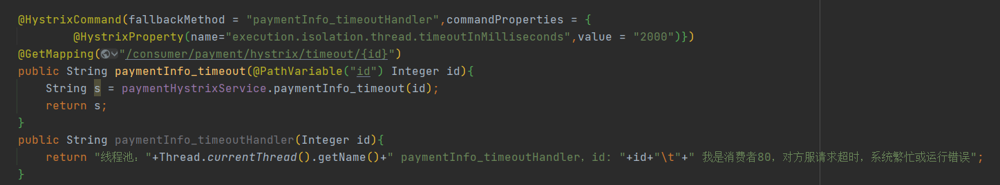

服务降级，客户端去调用服务端，碰上服务端宕机或关闭；需要为feign客户端定义的接口添加一个服务降级处理类即可实现解耦合

1. service接口添加 @FeignClient注解，value表示调用哪个服务，fallback表示服务降级后调用哪个类
~~~java
@Component
@FeignClient(value = "CLOUD-PROVIDER-HYSTRIX-PAYMENT",fallback = PaymentFallbackService.class)
public interface PaymentHystrixService {
    ...
}
~~~

2. 服务降级类 PaymentFallbackService
~~~java
@Component
public class PaymentFallbackService implements PaymentHystrixService{
    @Override
    public String paymentInfo_ok(Integer id) {
        return "PaymentFallbackService paymentInfo_ok Fallback 服务降级";
    }

    @Override
    public String paymentInfo_timeout(Integer id) {
        return "PaymentFallbackService paymentInfo_timeout Fallback 服务降级";
    }
}
~~~

## 服务熔断 
~~~text
达到最大访问量，直接拒绝访问，然后调用服务降级并返回友好提示；
三步：服务降级 -> 熔断 -> 恢复调用链路
~~~

* 熔断机制概述
~~~text
熔断机制是应对雪崩效应的一种微服务链路保护机制。当扇出链路的某个微服务出错不可用或者响应时间太长时，
会进行服务的降级，进而熔断该节点微服务的调用，快速返回错误的响应信息。
当检测到该节点微服务调用响应正常后，恢复调用链路。

在SpringCloud框架里，熔断机制通过Hystrix实现。Hystrix会监控微服务间调用的状况，当失败的调用到一定阈值，
缺省是5秒内20次调用失败，就会启动熔断机制。熔断机制的注解是 @HystrixCommand
~~~

服务端熔断service层，调用 @HystrixCommand 注解
~~~java
    // ---------------------- 服务熔断
    @HystrixCommand(fallbackMethod = "paymentCircuitBreaker_fallback",commandProperties = {
            @HystrixProperty(name="circuitBreaker.enabled",value = "true"), //开启熔断器
            @HystrixProperty(name="circuitBreaker.requestVolumeThreshold",value = "10"), //请求次数
            @HystrixProperty(name="circuitBreaker.sleepWindowInMilliseconds",value = "10000"), //时间窗口 10秒
            @HystrixProperty(name="circuitBreaker.errorThresholdPercentage",value = "10"), //失败率达到多少熔断跳闸
    })
    public String paymentCircuitBreaker(Long id) {

        if (id < 0) {
            throw new RuntimeException("id不能为负数");
        }
        String s = IdUtil.simpleUUID();
        return Thread.currentThread().getName() + " 调用成功，id= " + s;
    }

    public String paymentCircuitBreaker_fallback(Long id) {

        return "id不能为负数 id= " + id;
    }
~~~

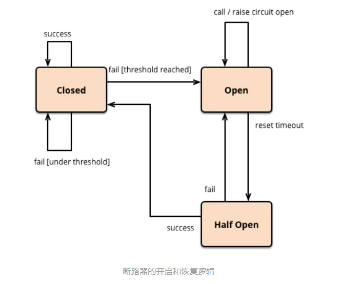

* 熔断类型
~~~text

熔断关闭 熔断关闭不会对服务进行熔断

熔断打开 请求不再调用当前服务，内部设置时钟一般为MTTR（平均故障处理时间），当打开时长达到所设时钟则进入半熔断状态

熔断半开 部分请求根据规则调用当前服务，如果请求成功且符合规则则认为当前服务恢复正常，关闭熔断

~~~

* 涉及到断路器的三个参数：快照时间窗口、请求总数阈值、错误百分比阈值
~~~text
快照时间窗口： 断路器确定是否打开需要统计一些请求和错误数据，而统计的时间范围就是快照时间窗口，默认最近是10秒

请求总数阈值： 在快照时间窗口内，必须满足请求总数阈值才有资格熔断。默认为20次，意味着在10秒内，如果该hystrix命令的调用次数不足20次，
            即使所有的请求都超时或失败，断路器都不会打开

错误百分比阈值：当请求总数在快照时间窗口内超过阈值，比如发生了30次调用，如果在这30次调用中，有15次发生超时异常，也就是超过50%的错误百分比，在默认设定50%的阈值情况下，就会把断路器打开。

~~~

* 断路开启关闭条件
~~~text
1.当满足一定的阈值的时候（默认10秒内超过20次请求次数）
2.当失败率达到一定的时候（默认10秒内超过50%的请求失败）

到达以上阈值，断路器开启，服务熔断，所有请求不会转发

3.一段时间后（默认5秒），这时断路器是半开状态，会让其中一个请求转发，如果成功，断路器关闭，若失败，继续开启

~~~

* 断路器打开后
~~~text
1. 再有请求调用时，不会调用主逻辑而是服务降级fallback，通过断路器，实现自动发现错误并将主逻辑切换为降级逻辑，减少响应延迟的效果。

2.原来的主逻辑该如果恢复？

对于这个问题，hystrix也为我们实现了自动恢复功能。

当断路器打开，对主逻辑进行熔断之后，hystrix会启动一个休眠时间窗，在这个时间窗内，降级逻辑临时的成为主逻辑。
当休眠时间窗到期，断路器进入半开状态，释放一次请求到原来的主逻辑上，如果此次请求正常返回，那么断路器关闭，主逻辑恢复，如果请求还有问题，断路器继续打开，休眠重新计算。

~~~

## 服务限流
秒杀或高并发等，严禁拥挤，排队有序进行

## 降级容错解决

1. 超时导致服务器变慢 ——> 超时不再等待

2. 出错（宕机或者程序出问题） ——> 出错要兜底

解决办法
~~~text
对方服务（8001）超时、宕机，调用者（80）不能一直卡死等待，必须服务降级
对方服务（8001）ok，调用者（80）自己出故障或有自我要求（自己的等待时间小于服务提供者），自己处理降级
~~~

## hystrix图形化
概述
~~~text
除了隔离依赖服务的调用以外，hystrix还提供了准实时的调用监控（hystrix Dashboard）,hystrix会持续的记录所有通过hystrix发起的请求执行信息，
并以统计报表的和图表的形式展示给客户，包括每秒执行多少请求多少次成功，多少次失败等。Netflix通过hystrix-metrics-event-stream项目实现监控。
SpringCloud也提供了Hystrix Dashboard的整合，对监控内容转化为可视化界面。
~~~

添加hystrix dashboard 可视化工具依赖
~~~xml
<!--hystrix dashboard 可视化工具-->
<dependency>
   <groupId>org.springframework.cloud</groupId>
   <artifactId>spring-cloud-starter-netflix-hystrix-dashboard</artifactId>
</dependency>
~~~

开启 hystrix Dashboard 可视化工具注解 @EnableHystrixDashboard
~~~java
@SpringBootApplication
@EnableHystrixDashboard //开启 hystrix Dashboard 可视化工具
public class HystrixBashboardMain9001 {
   public static void main(String[] args) {
      SpringApplication.run(HystrixBashboardMain9001.class,args);
   }
}
~~~

在需要可视化监控的服务启动项中 注入 为服务监控配置
~~~java
@SpringBootApplication
@EnableDiscoveryClient
@EnableCircuitBreaker //服务熔断
public class PaymentHystrixMain8001 {
   public static void main(String[] args) {
      SpringApplication.run(PaymentHystrixMain8001.class,args);
   }
   /*
    * 为服务监控配置
    * */
   @Bean
   public ServletRegistrationBean getServlet() {
      HystrixMetricsStreamServlet streamServlet = new HystrixMetricsStreamServlet();
      ServletRegistrationBean registrationBean = new ServletRegistrationBean(streamServlet);
      registrationBean.setLoadOnStartup(1);
      registrationBean.addUrlMappings("/hystrix.stream");
      registrationBean.setName("HystrixMetricsStreamServlet");
      return registrationBean;
   }
}
~~~

启动地址：http://localhost:8001/hystrix.stream

# 网关 Gateway

* 概述

核心逻辑：路由转发 + 执行过滤器链
~~~text
Gateway 是在Spring生态系统之上构建的API网关服务，基于Spring5、Springboot2和Project Reactor等技术
Gateway旨在提供一种简单而有效的方式来对API进行路由，以及提供一些强大的过滤器功能，例如：熔断、限流、重试等

SpringCloud Gateway 作为SpringCloud生态系统中的网关，目标是替代Zuul，在SpringCloud2.0以上版本中，没有对新版本的Zuul2.0
以上最新高性能版本进行集成，仍然还是使用的Zuul1.x非Reactor模式的老版本。而为了提升网关的性能，SpringCloud Gateway是基于WebFlux
框架实现的，而WebFlux框架底层则使用了高性能的Reactor模式通信框架Netty

SpringCloud Gateway的目标提供统一的路由方式且基于Filter链的方式提供了网关基本的功能，例如：安全，监控、指标和限流

~~~

* 网关能干嘛？

~~~text
反向代理
鉴权
流量控制
熔断
日志监控
~~~

* 微服务架构中网关位置

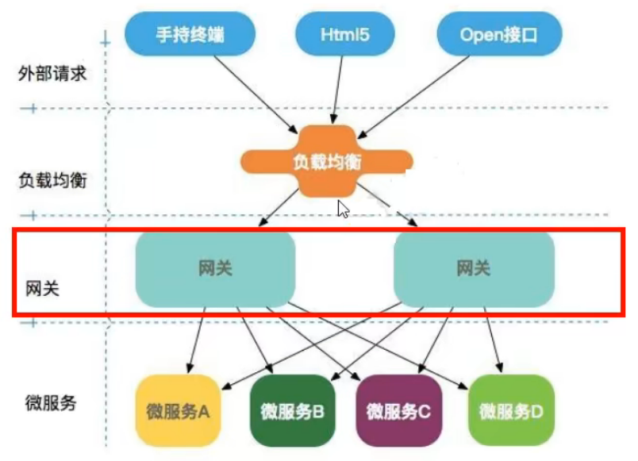

* Gateway特性

~~~text
基于spring Framework 5，Project Reactor 和 Spring Boot 2.0进行构建
动态路由：能够匹配任何请求属性
可以对路由指定易于编写的 Predicate（断言）和 Filter（过滤器）
集成Hystrix的断路器功能
集成SpringCloud服务发现功能
请求限流功能
支持路径重写
~~~

* Gateway和Zuul的区别
~~~text
1.Zuul1.x是基于 阻塞I/O的API Gateway

2.Zuul1.x基于Servlet2.5使用 阻塞框架，它不支持任何长连接（如webSocket）Zuul的设计模式和Nginx比较像，每次I/O操作都是从工作线程中选择一个执行，
请求线程被阻塞到工作线程完成，但是相差别的是Nginx是用C++实现，Zuul是用Java实现，而JVM本身会有第一次加载较慢的情况，使得Zuul的性能相比较差

3.Zuul2.x理念更加先进，想基于非阻塞和支持长连接，Zuul2.x的性能是1.x的1.6倍

4.Gateway建立在Spring Framework 5、Reactor和Springboot2.0之上，使用非阻塞API；还支持长连接（webSocket）
~~~

* 为什么使用非阻塞异步模型？
~~~text
springCloud中所集成的Zuul版本，采用的是Tomcat容器，使用的是传统的Servlet IO处理模型

Servlet生命周期，是由servlet container进行生命周期管理。container启动时构造servlet对象并调用servlet init()进行初始化
container运行时接收请求，并为每个请求分配一个线程（一般从线程池获取空闲线程）然后调用service()，container关闭调用servlet destroy()销毁servlet

上述模型的缺点：

servlet是一个简单的网络IO模型，当请求进入servlet container时，servlet container就会为其绑定一个线程，在并发不高的场景下这种模型是适用的。
但是一旦高并发，线程数量就会上涨，而线程资源代价是昂贵的（上线文切换，内存消耗大）严重影响请求的处理时间。在一些简单业务场景下，不希望为每个request分配一个线程，
只需要1个或几个线程就能应对极大并发的请求，这种业务员场景下servlet模型没有

所以Zuul1.x是基于servlet之上的一个阻塞式处理模型，即spring实现了处理所有request请求的一个servlet(DispatcherServlet)并由该servlet阻塞式处理。
所以zuul无法摆脱servlet模型的弊端
~~~

* WebFlux是典型的非阻塞异步框架
~~~text
传统的web框架，比如：struts2，springMVC都是基于Servlet API与Servlet容器基础之上运行的

但是在Servlet3.1之后有了异步非阻塞的支持，而WebFlux是一个典型非阻塞异步的框架，它的核心是基于Reactor的相关API实现的。
相对于传统的web框架来说，它可以运行诸如Netty、Undertow及Servlet3.1的容器上。非阻塞+函数式编程（spring5必须让你使用java8）

Spring WebFlux 是 Spring 5.0 引入的新的响应式框架，区别于 SpringMVC，它不需要依赖Servlet API，它是完全异步非阻塞的，并且基于
Reactor来实现响应式流规范

~~~

* gateway工作流程

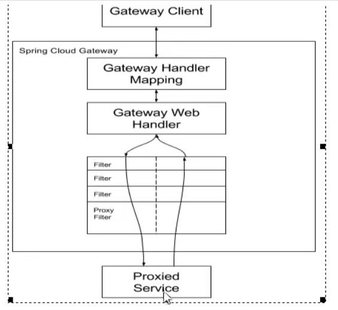

~~~text
客户端向SpringCloudGateway发送请求，然后在Gateway Handler Mapping中找到与请求相匹配的路由，将其发送到Gateway Web Handler.

Handler再通过指定的过滤器链来将请求发送到我们实际的服务执行业务逻辑，然后返回。
过滤器之间用虚线放开是因为过滤器可能会在发送代理请求之间（"pre"）或之后（"post"）执行业务逻辑 

Filter在“pre”类型的过滤器可以做参数校验、流量控制、日志输出、协议转换等，在“post”类型的过滤器中可以做响应内容、响应头的修改，日志的输出，流量监控等有着非常重要的作用。
~~~

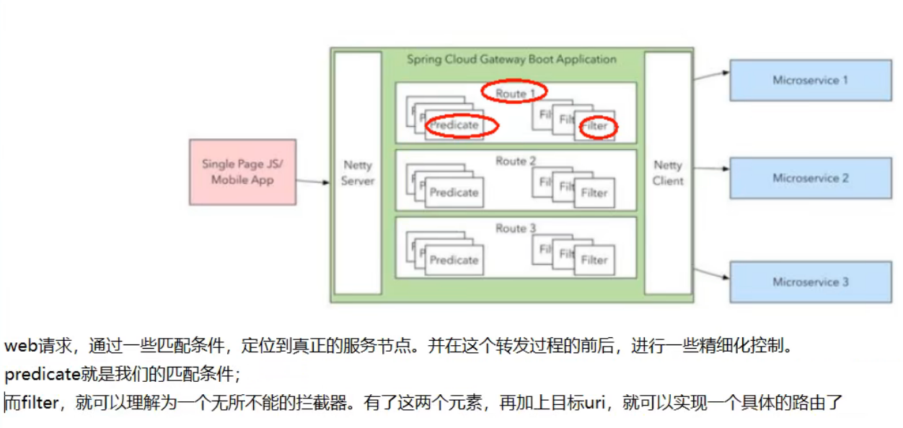

## Route 路由

概述：路由是构建网关的基本模块，它由ID，目标URI，一系列的断言和过滤器组成，如果断言为true则匹配该路由

* gateway路由配置过程

yml文件配置gateway网关 对8001服务端接口进行包装
~~~yaml
spring:
   cloud:
    gateway: #gateway网关配置
      routes:
         - id: payment_routh                #路由的ID，没有固定规则但要求唯一，建议配合服务名
           uri: http://localhost:8001       #匹配后提供服务的路由地址
           predicates:
              - Path=/payment/get/**         #断言，路径相匹配的进行路由

         - id: payment_routh2
           uri: http://localhost:8001
           predicates:
              - Path=/payment/lb/**
~~~

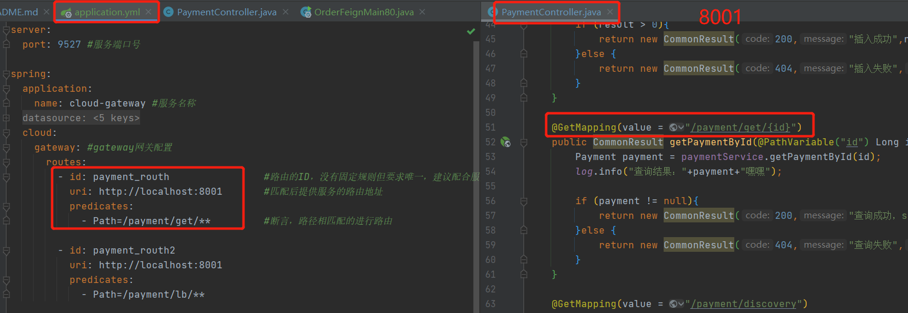

* 动态路由

在yml文件开启 网关动态路由 uri地址改为注册中心的服务别名
~~~yaml
spring:
   cloud:
      gateway: #gateway网关配置
         discovery:
            locator:
               enabled: true #开启从注册中心 动态创建路由 的功能，利用微服务别名进行路由
         routes:
            - id: payment_routh                #路由的ID，没有固定规则但要求唯一，建议配合服务名
               #          uri: http://localhost:8001       #匹配后提供服务的路由地址
              uri: lb://cloud-payment-service   #匹配后提供服务的别名
              predicates:
                 - Path=/payment/get/**         #断言，路径相匹配的进行路由
            - id: payment_routh2
               #          uri: http://localhost:8001
              uri: lb://cloud-payment-service   #匹配后提供服务的别名
              predicates:
                 - Path=/payment/lb/**
~~~

## Predicate 断言

概述：参考Java8的java.function.Predicate;开发人员可以匹配HTTP请求中的所有内容（例如请求头或请求参数），如果请求与断言相符匹配则进行路由

~~~text
Gateway将路由匹配作为Spring WebFlux HandlerMapping基础架构的一部分。
Gateway包括许多内置的Route Predicate Factory(路由断言工厂)，所有这些Predicate都与HTTP请求的不同属性匹配，多个断言可以进行组合。
~~~

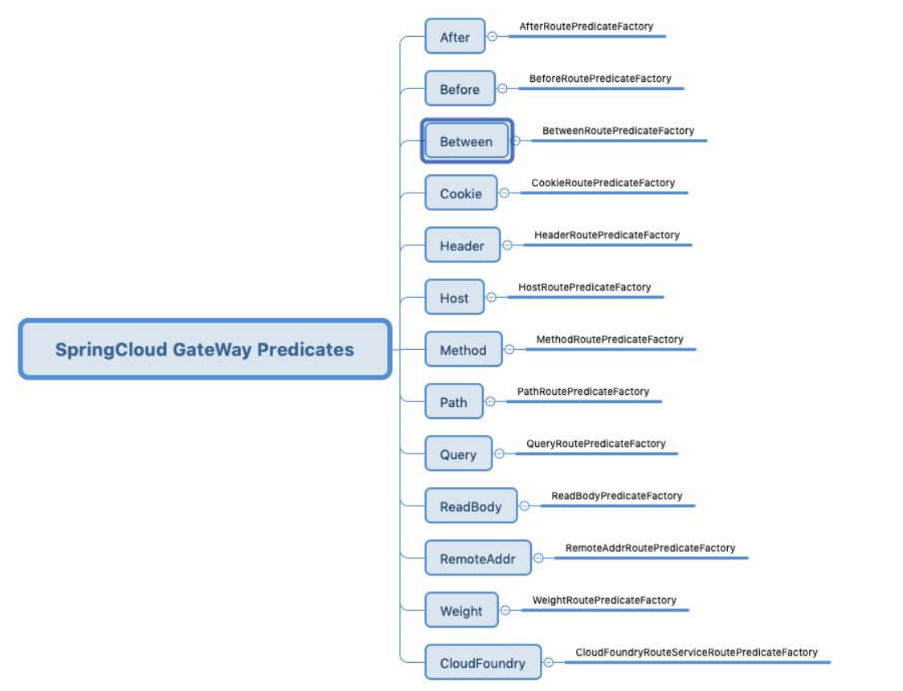

~~~yaml
spring:
   cloud:
      gateway: #gateway网关配置
         discovery:
            locator:
               enabled: true #开启从注册中心 动态创建路由 的功能，利用微服务别名进行路由
         routes:
            - id: payment_routh                #路由的ID，没有固定规则但要求唯一，建议配合服务名
               #          uri: http://localhost:8001       #匹配后提供服务的路由地址
              uri: lb://cloud-payment-service   #匹配后提供服务的别名
              predicates:
                 - Path=/payment/get/**         #断言，路径相匹配的进行路由
            - id: payment_routh2
               #          uri: http://localhost:8001
              uri: lb://cloud-payment-service   #匹配后提供服务的别名
              predicates:
                 - Path=/payment/lb/**
                 - After=2022-03-01T11:12:29.724+08:00[Asia/Shanghai]
                 - Cookie=username,zzyy
                 - header=X-Request-Id, \d+ #请求头要有X-Request-Id属性，并且值为整数的正则表达式
                 - Host=**.atguigu.com
                 - Method=GET
                 - Query=username, \d+ #要有参数名username并且值还要是整数才能路由
~~~

## Filter 过滤器

概述：指的是Spring框架中GatewayFilter的实例，使用过滤器，可以在请求被路由前或后对请求进行修改

配置全局网关过滤器
~~~java
/**
 * GlobalGatewayFilter 全局网关过滤器
 */
@Component
@Slf4j
public class MyLogGatewayFilter implements GlobalFilter, Ordered {
    @Override
    public Mono<Void> filter(ServerWebExchange exchange, GatewayFilterChain chain) {
        String name = exchange.getRequest().getQueryParams().getFirst("name");
        if (name == null){
            log.info("非法用户，禁止入内");
            exchange.getResponse().setStatusCode(HttpStatus.NOT_ACCEPTABLE);
            return exchange.getResponse().setComplete();
        }
        return chain.filter(exchange);
    }
    @Override
    public int getOrder() {
        return 0;
    }
}
~~~

# SpringCloud Config Server

* 概述
~~~text
SpringCloud Config 为微服务架构中的微服务提供集中化的外部配置支持，配置服务器为各个不同微服务应用的所有环境提供了一个中心化的外部配置

SpringCloud Config 分为 服务端 和 客户端

服务端也称为分配式配置中心，它是一个独立的微服务应用，用来连接配置服务器并为客户端提供获取配置信息，加密、解密信息等访问接口

客户端则是通过指定的配置中心来管理应用资源，以及与业务相关的配置内容，并在启动的时候从配置中心获取和加载配置信息配置服务器默认采用git来存储配置信息，
这样就有助于对环境配置进行版本管理，并且可以通过git客户端工具来方便的管理和访问配置内容
~~~

* config 配置中心可以做什么？

~~~text
集中管理配置文件
不同环境不同配置，动态化的配置更新。分环境部署比如dev/test/prod/beta/release
运行期间动态调整配置，不再需要在每个服务部署的机器上编写配置文件，服务会向配置中心统一拉取配置自己的信息
当配置发送变化时，服务不需要重启即可感知到配置的变化并应用新的配置
将配置信息以REST接口的形式暴露 ——> post、curl访问刷新即可

~~~

* config 配置中心 搭建

在yml配置git仓库地址
~~~yaml
spring:
  application:
    name: cloud-config-server
  cloud:
    config:
      server:
        git:
#          uri: git@github.com:TheFrogtheFlower1996/cloud-config.git #github上面的git仓库名字
          uri: https://github.com/TheFrogtheFlower1996/cloud-config #github上面的git仓库名字
          search-paths:
            - cloud-config
      label: master #读取分支
# http://localhost:3344/master/config-dev.yml 访问地址
~~~

在启动类上面开启 @EnableConfigServer 配置中心注解
~~~java
@SpringBootApplication
@EnableConfigServer //开启配置中心
public class ConfigCenterMain3344 {
    public static void main(String[] args) {
        SpringApplication.run(ConfigCenterMain3344.class,args);
    }
}
~~~

访问地址 http://localhost:3344/master/config-dev.yml 

## bootstrap.yml

* 概述

~~~text
application.yml 是用户级别的资源配置项
bootstrap.yml 是系统级的，优先级更高

SpringCloud会创建一个 “Bootstrap Context”，作为Spring应用的 Application Context 的上下问。
初始化的时候，Bootstrap Context 负责从外部源加载配置属性并解析配置。这两个上下文共享一个从外部获取的 Environment.

Bootstrap 属性有高优先级，默认情况下，它们不会被本地配置覆盖。Bootstrap Context 和 Application Context 有着不同的约定，
所以新增一个 bootstrap.yml文件，保证Bootstrap Context 和 Application Context配置的分离

要将Client模块下的application.yml文件改为bootstrap.yml，这时很关键的，
因为bootstrap.yml是比application.yml先加载的。bootstrap.yml优先级高于application.yml
~~~

