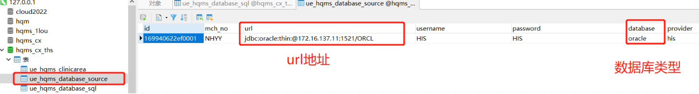

# 叫号

## 开发从取号机点击取或扫码或自助机接口调用 取号功能。动态绑定医院his，根据病案号查询oracle数据库，将病人放入redis签到队列

1. 数据库database_source 配置his数据库信息

2. 动态获取数据库关于his数据库信息(url地址，账号密码)，调用Db.findFirst方法，在该方法中定义SQL语句，查询病人信息

~~~ java
Record ls= Db.use(ueHqmsDatabaseSource.getProvider()).findFirst("select * from JK_SSHJ.V_GHJL_YK where BAH='"+bah+"'");
~~~

3. 向redis添加签到队列，使用 zSetOperations.add(key,value,score) 方法
~~~ java
redisService.setZSet(depCode + "C", ueHqmsPatientQueueS, ordernum);
~~~

## 制定和开发分诊台和叫号器 叫号逻辑功能，对分诊过程进行流程控制

1. 获取redis签到逻辑和叫号逻辑，zSetOperations.rangeWithScores(key, start, end);查询集合中指定顺序的值和score，该集合是按照score顺序排列
~~~java
Set<ZSetOperations.TypedTuple<String>> signList = redisService.rangeWithScore(depCode + 'C', 0, -1); //签到队列
Set<ZSetOperations.TypedTuple<String>> callList = redisService.rangeWithScore(depCode + "C-" + step + "-" + table, 0, -1);//叫号队列
~~~

2. 删除或插入redis中指定key的值 zSetOperations.remove(key,value); zSetOperations.add(key,value,score);
~~~java
redisService.removeZSet(depCode + "C-" + step + "-" + table, stringTypedTuple.getValue());
~~~

3. 叫号逻辑
~~~text
1. 病人有 签到队列 叫号队列 过号队列
2. 叫号队列有一个正在叫号病人和一个候诊病人，一次叫号拉取签到队列两个病人，过号有单独的再叫号队列

3. 当有流程控制时，

~~~

